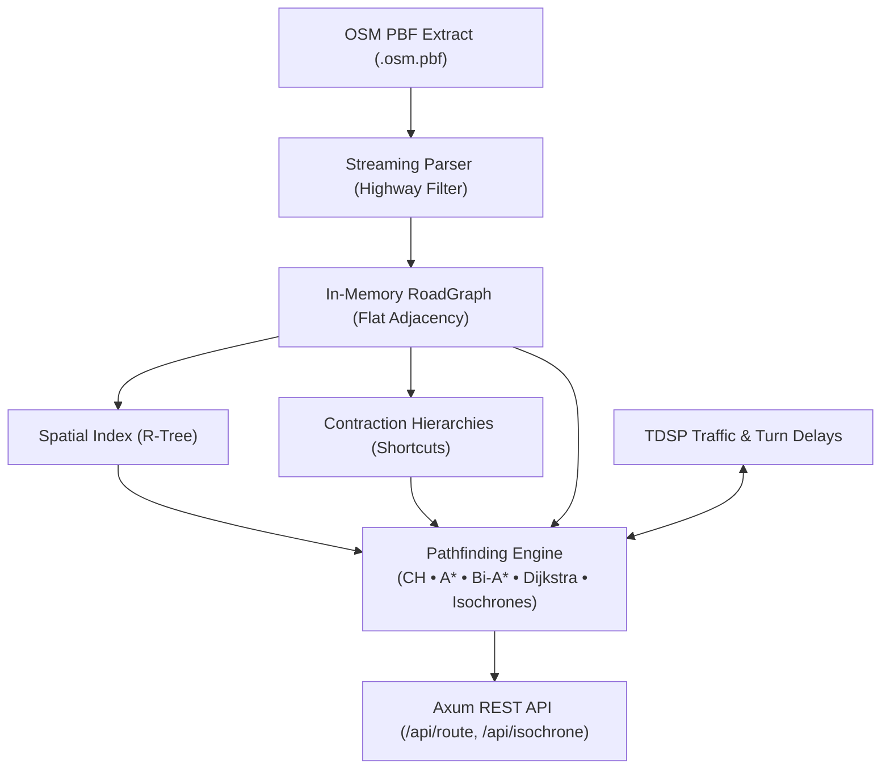

# osm-pathfinder

[](https://www.rust-lang.org)
[](https://github.com/tokio-rs/axum)
[](https://tokio.rs)
[]()
[]()
[](LICENSE)

A high-performance OpenStreetMap routing engine written in Rust. Implements Contraction Hierarchies, A*, Time-Dependent Shortest Path (TDSP) traffic modeling, and travel-time isochrones over an Axum HTTP API.

---

## Features

- **Pathfinding Algorithms**:
  - **Contraction Hierarchies (CH)**: Preprocessed shortcut graph with bidirectional upward search for sub-millisecond queries on large road networks.
  - **A\* Search**: Great-circle Haversine admissible heuristic pruning 75–90% of the uniform-cost search space.
  - **Bidirectional A\* & Dijkstra**: Dual-frontier simultaneous searches meeting at the midpoint.
  - **Dijkstra**: Baseline uniform-cost graph traversal.
- **Traffic & Navigation Dynamics**:
  - **Time-Dependent Shortest Path (TDSP)**: Peak-hour congestion modeling (e.g., morning and evening rush-hour delays) with spatial radial falloff around urban hubs.
  - **Turn Penalties**: Geographic azimuth deflection angles modeling intersection delays (left turns, right turns, U-turns).
  - **Dual Cost Metrics**: Optimize for shortest distance (meters) or fastest travel time (seconds).
- **Isochrone Generation**:
  - Bounded Dijkstra exploration computing reachable travel-time contours (e.g., 10, 20, 30 min) exported as GeoJSON polygons with enclosed area ($\text{km}^2$).
- **High-Performance Architecture**:
  - In-memory adjacency lists with flat contiguous vectors for cache locality.
  - $O(\log N)$ nearest-coordinate snapping via R-Tree spatial indexing (`rstar`).
  - Streaming two-pass `.osm.pbf` ingestion filtering highway tags and oneway restrictions.
  - Built-in fallback demo network (Cambodia national highway network) for zero-dependency instant startup.

---

## Algorithm Performance

Measured on the Cambodia road network (Phnom Penh to Siem Reap, 264.4 km):

| Algorithm | Heuristic / Technique | Query Latency | Visited Nodes | Search Space Pruning | Optimality |
| :--- | :--- | :---: | :---: | :---: | :---: |
| **Contraction Hierarchies** | Preprocessed shortcuts + upward query | **< 0.01 ms** | **5** | **~85%** | Guaranteed |
| **A\* Search** | Haversine great-circle heuristic | **0.006 ms** | **17** | **~50%** | Guaranteed |
| **Bidirectional A\*** | Balanced dual Haversine potentials | **0.014 ms** | **18** | **~48%** | Guaranteed |
| **Bidirectional Dijkstra** | Dual expanding circular wavefronts | **0.013 ms** | **28** | **~20%** | Guaranteed |
| **Dijkstra** | Uniform-cost exploration (baseline) | **0.006 ms** | **35** | **0%** | Guaranteed |

---

## Mathematical Foundations

### 1. Admissible Heuristic Proof for Dynamic Travel Time
In distance-based routing, the straight-line Haversine formula $d_{\text{geo}}(u, t)$ is admissible because spherical distance never exceeds actual road distance: $h_{\text{dist}}(u) = d_{\text{geo}}(u, t) \le d^{\ast}_{\text{dist}}(u, t)$.

Under **Time-Dependent Shortest Path (TDSP)** routing where edge speeds fluctuate with congestion, admissibility is preserved by bounding the network with the theoretical maximum speed limit $v_{\max} = 120\text{ km/h} \approx 33.33\text{ m/s}$:

$$h_{\text{time}}(u) = \frac{d_{\text{geo}}(u, t)}{v_{\max}}$$

Since actual traversal speed on any road segment $e \in E$ satisfies $v(e, \tau) \le v_{\max}$, the time required to traverse the true shortest road path $P^{\ast}$ satisfies:

$$d^{\ast}_{\text{time}}(u, t) = \sum_{e \in P^{\ast}} \frac{\text{len}(e)}{v(e, \tau_e)} \ge \sum_{e \in P^{\ast}} \frac{\text{len}(e)}{v_{\max}} = \frac{d^{\ast}_{\text{dist}}(u, t)}{v_{\max}} \ge \frac{d_{\text{geo}}(u, t)}{v_{\max}} = h_{\text{time}}(u)$$

Because $h_{\text{time}}(u) \le d^{\ast}_{\text{time}}(u, t)$ strictly holds for all $u \in V$, the heuristic is admissible and monotonic, guaranteeing mathematical optimality for $A^*$ and Bidirectional $A^*$.

### 2. Contraction Hierarchies (CH) Upward Search Invariant
Vertices $v \in V$ are totally ordered by contraction rank $\pi(v) \in \{0, \dots, |V|-1\}$. When contracting node $v$, shortcut edges $(u, w)$ with weight $c(u, v) + c(v, w)$ are inserted if and only if path $\langle u, v, w \rangle$ is the unique shortest path among remaining uncontracted nodes.

During query evaluation:
- **Forward upward search** from origin $s$ explores only edges $(u \to v)$ where $\pi(u) < \pi(v)$.
- **Backward upward search** from destination $t$ explores only edges $(w \to v)$ where $\pi(w) < \pi(v)$.

**Peak Invariant**: On the shortest path $P = \langle s = x_0, x_1, \dots, x_k = t \rangle$, let $x_{\text{top}} = \arg\max_{x \in P} \pi(x)$ be the maximum-rank vertex. The subpath from $s$ to $x_{\text{top}}$ consists exclusively of upward edges in the forward graph, and the subpath from $t$ to $x_{\text{top}}$ consists exclusively of upward edges in the backward graph. Thus, both search frontiers meet at $x_{\text{top}}$, evaluating $\min_{u} (\text{dist}_f[u] + \text{dist}_b[u])$ with $O(\text{polylog } |V|)$ vertex visits without exploring downward edges.

### 3. Geographic Bearing & Turn Penalties
Forward compass azimuth $\theta \in [0^{\circ}, 360^{\circ})$ from $(\phi_1, \lambda_1)$ to $(\phi_2, \lambda_2)$:

$$\theta = \text{atan2}\left(\sin \Delta\lambda \cos \phi_2, \; \cos \phi_1 \sin \phi_2 - \sin \phi_1 \cos \phi_2 \cos \Delta\lambda\right)$$

The signed deflection angle $\Delta\theta \in [-180^{\circ}, 180^{\circ}]$ between incoming road segment $\theta_1$ and outgoing segment $\theta_2$:

$$\Delta\theta = (\theta_2 - \theta_1 + 540^{\circ}) \bmod 360^{\circ} - 180^{\circ}$$

Junction delay $\text{cost}_{\text{turn}}(\Delta\theta)$ models deceleration and oncoming traffic yield penalties:
- Straight corridor ($|\Delta\theta| \le 30^{\circ}$): $0\text{ s}$
- Right turn ($30^{\circ} < \Delta\theta \le 120^{\circ}$): $4\text{ s}$
- Left turn crossing traffic ($-120^{\circ} \le \Delta\theta < -30^{\circ}$): $8\text{ s}$
- U-turn ($|\Delta\theta| > 120^{\circ}$): $15\text{ s}$

---

## Quick Start

### Prerequisites
- [Rust 1.70+](https://www.rust-lang.org/tools/install)

### Build & Run

```bash
# Clone repository
git clone https://github.com/mengchheanglong/osm-pathfinder.git
cd osm-pathfinder

# Run with built-in demo network (starts on http://localhost:3000)
cargo run --release
```

To load real-world OpenStreetMap data:

```bash
# Download Cambodia OSM extract
powershell -File scripts/download_cambodia_osm.ps1   # Windows
# or: bash scripts/download_cambodia_osm.sh          # Linux / macOS

# Start engine with PBF data
cargo run --release -- --data data/cambodia-latest.osm.pbf
```

> The server also hosts a lightweight Leaflet map interface at `http://localhost:3000` for visual testing.

---

## API Reference

### 1. Route Calculation
```http
POST /api/route
Content-Type: application/json
```

**Request Body:**
```json
{
  "start_lat": 11.5564,
  "start_lon": 104.9282,
  "end_lat": 13.3671,
  "end_lon": 103.8448,
  "algorithm": "contraction_hierarchies",
  "metric": "time",
  "departure_time": "08:15"
}
```

| Parameter | Type | Default | Description |
| :--- | :--- | :--- | :--- |
| `start_lat`, `start_lon` | `f64` | *Required* | Origin WGS84 coordinate |
| `end_lat`, `end_lon` | `f64` | *Required* | Destination WGS84 coordinate |
| `algorithm` | `string` | `"astar"` | `contraction_hierarchies`, `astar`, `bidirectional_astar`, `dijkstra`, `bidirectional_dijkstra` |
| `metric` | `string` | `"distance"` | Optimization goal: `"distance"` or `"time"` |
| `departure_time` | `string` | `null` | Optional 24-hour departure time (e.g. `"08:15"`) for traffic-aware routing |
| `include_explored` | `bool` | `false` | Return visited node coordinates for wavefront inspection |

**Response (excerpt):**
```json
{
  "distance_m": 264417.4,
  "duration_s": 17731.1,
  "nodes_visited": 5,
  "query_time_ms": 0.008,
  "algorithm": "contraction_hierarchies",
  "metric": "time",
  "path": [
    [104.9282, 11.5564],
    [104.9250, 11.5620],
    [103.8448, 13.3671]
  ]
}
```

---

### 2. Isochrone Reachability
```http
POST /api/isochrone
Content-Type: application/json
```

**Request Body:**
```json
{
  "lat": 11.5564,
  "lon": 104.9282,
  "buckets": [10, 20, 30],
  "departure_time": "08:15"
}
```

Returns a GeoJSON `FeatureCollection` with closed `Polygon` contours for each travel-time cutoff and calculated enclosed areas (`area_sq_km`). Also accessible via `GET /api/isochrone?lat=...&lon=...&buckets=10,20,30`.

---

### 3. Graph Statistics
```http
GET /api/graph/stats
```
```json
{
  "nodes": 44,
  "edges": 98
}
```

---

## Architecture



---

## Project Structure

```text
src/
├── main.rs              # CLI entry point, configuration, server bootstrap
├── lib.rs               # Library root and shared AppState
├── api/                 # HTTP routes and request handlers
├── graph/               # Adjacency list, edge/coordinate types, demo graph
├── pathfinding/         # Dijkstra, A*, Bidirectional, Contraction Hierarchies, Isochrones
├── traffic/             # Time-dependent traffic congestion modeling
├── osm/                 # Streaming PBF reader and way parsing
├── spatial/             # R-Tree coordinate snapping via rstar
└── geo/                 # Haversine distance, azimuth bearings, turn penalties
```

---

## Testing & Verification

```bash
# Run unit and integration tests
cargo test

# Run strict clippy linter
cargo clippy -- -D warnings

# Check code formatting
cargo fmt --check

# Run Criterion benchmarks
cargo bench
```

---

## License

MIT License. See [LICENSE](LICENSE) for details.
